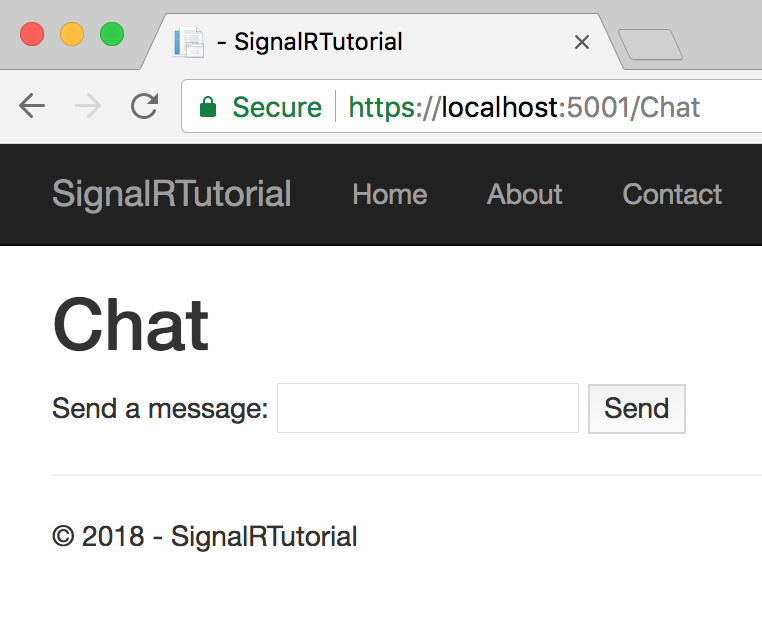
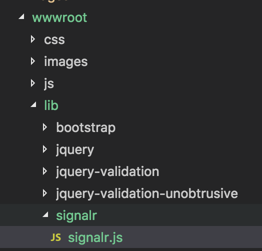

# Getting Started with SignalR for ASP.NET Core 2.1 Preview 1

SignalR is a library that simplifies the process of adding real-time web functionality to applications. With SignalR, you can build server applications that can "push" data to browsers and other clients without the client having to request or poll for the data. In ASP.NET Core 2.1 Preview 1, SignalR is now available for ASP.NET Core! This tutorial shows you how to get started with SignalR in ASP.NET Core 2.1 Preview 1.

## Prerequisites

In order to use this template you need the following tools:

1. .NET Core SDK version 2.1.300 or higher.
2. Node JS (just needed for NPM, to download the SignalR JavaScript library; we strongly recommend using at least version 8.9.4 of Node).
3. Your IDE/Editor of choice.

## Building the UI

Let's start by building a simple UI for a simple chat app. First, create a new Razor pages application using `dotnet new`:

```
› dotnet new razor -au Individual --name SignalRTutorial
```

Add a new page for the chat UI:

```
› cd SignalRTutorial/Pages
› dotnet new page --name Chat
```

You should now have `Pages/Chat.cshtml` and `Pages/Chat.cshtml.cs` files in your project. First, open `Pages/Chat.cshtml.cs`, change the namespace name to match your other page models and add the `Authorize` attribute to ensure only authenticated users can access the Hubs.

```csharp
using System;
using System.Collections.Generic;
using System.Linq;
using System.Threading.Tasks;
using Microsoft.AspNetCore.Authorization;
using Microsoft.AspNetCore.Mvc;
using Microsoft.AspNetCore.Mvc.RazorPages;

namespace SignalRTutorial.Pages
{
    [Authorize]
    public class ChatModel : PageModel
    {
        public void OnGet()
        {
        }
    }
}
```

Next, open `Pages/Chat.cshtml` and add some UI:

```html
@page
@model ChatModel
@{
}

<h1>Chat</h1>

<form id="send-form">
    Send a message: 
    <input type="text" id="message-textbox" disabled /> 
    <button id="send-button" type="submit" disabled>Send</button>
</form>

<ul id="messages-list">
</ul>
```

The UI we've added is fairly simple. We're going to use the ASP.NET Core Identity framework for authentication, which means the user will have a name when they get here. To try it out, use `dotnet run` to launch the site and Register as a new user. Then navigate to the `/Chat` endpoint, you should see the following UI:



## Writing the server code

In SignalR, you put server-side code in a "Hub". Hubs contain methods that the SignalR Client allows you to invoke from the browser, much like how an MVC controller has actions that are invoked by issuing HTTP requests. However, unlike an MVC Controller Action, SignalR allows the **server** to invoke methods on the **client** as well, allowing you to develop real-time applications that notify users of new content.

So, first, we need to build a hub. Back in the root of the project, create a `Hubs` directory and add a new file to that directory called `ChatHub.cs`:

```csharp
using System;
using System.Threading.Tasks;
using Microsoft.AspNetCore.Authorization;
using Microsoft.AspNetCore.SignalR;

namespace SignalRTutorial.Hubs
{
    [Authorize]
    public class ChatHub : Hub
    {
        public override async Task OnConnectedAsync()
        {
            await Clients.All.SendAsync("SendAction", Context.User.Identity.Name, "joined");
        }

        public override async Task OnDisconnectedAsync(Exception ex)
        {
            await Clients.All.SendAsync("SendAction", Context.User.Identity.Name, "left");
        }

        public async Task Send(string message)
        {
            await Clients.All.SendAsync("SendMessage", $"{Context.User.Identity.Name}: {message}");
        }
    }
}
```

Let's go back over that code a little bit and look at what it does. First, we have a class inheriting from `Hub`, which is the base class required for all SignalR Hubs. We apply the `[Authorize]` attribute to it which restricts access to the Hub to registered users and ensures that `Context.User` is available for us in the Hub methods. Inside Hub methods, you can use the `Clients` property to access various collections of clients. We use the `.All` property, which gives us an object that can be used to send messages to every client connected to the Hub.

When a new client connects, the `OnConnectedAsync` method will be invoked. We override that method to Send the `SendAction` message to every client, and provide two arguments: The name of the user, and the action that occurred (in this case, that they "joined" the chat session). We do the same for `OnDisconnectedAsync`, which is invoked when a client disconnects.

When a client invokes the `Send` method, we Send the `SendMessage` message to every client, again providing two arguments: The name of the user sending the message and the message itself. Every client will receive this message, including the sending client itself.

To finish off the server-side, we need to add SignalR to our application. We do that in the `Startup.cs` file. First, in the `ConfigureServices` method, add the following to the end of that method to register the necessary SignalR services into the DI container:

```csharp
public void ConfigureServices(IServiceCollection services)
{
    // ... MVC and other services ...

    services.AddSignalR();
}
```

Then, we need to put SignalR into the middleware pipeline, and give our `ChatHub` hub a URL that the client can reference. We do that by adding these lines to the **end** of the `Configure` method:

```csharp
public void Configure(IApplicationBuilder app, IHostingEnvironment env)
{
    // ... other middleware ...

    app.UseSignalR(routes =>
    {
        routes.MapHub<ChatHub>("/hubs/chat");
    });
}
```

This configures the hub so that it is available at the URL `/hubs/chat`. You can use any URL you want, but it can't match an existing MVC action or Razor Page.

**NOTE**: You'll need to add a using directive for `SignalRTutorial.Hubs` in order to use `ChatHub` in your `MapHub` call.

## Building the client-side

Now that we have the server hub up and running, we need to add code to the `Chat.cshtml` page to use the client. First, however, we need to get the SignalR JavaScript client and add it to our application. There are many ways you can do this, such as using a bundling tool like Webpack, but here we're going to go with a fairly simple approach of copying and pasting.

First, create a `package.json` file to hold JavaScript dependencies for the application:

```
› npm init -y
```

Then, install the SignalR client:

```
› npm install @aspnet/signalr
```

You can find the version of the client designed for use in Browsers in `node_modules/@aspnet/signalr/dist/browser`. There are minified files there as well. For now, let's just copy the `signalr.js` file out of that directory and into `wwwroot/lib/signalr` in the project:



Now, we can add JavaScript to our `Chat.cshtml` page to wire everything up. At the end of the file (after the closing `</ul>` tag), add the following:

```html
@section Scripts {
    <script src="/lib/signalr/signalr.js"></script>
    <script type="text/javascript">
        // Bind DOM elements
        var sendForm = document.getElementById("send-form");
        var messagesList = document.getElementById("messages-list");
        var messageTextBox = document.getElementById("message-textbox");

        function appendMessage(content) {
            var li = document.createElement("li");
            li.innerText = content;
            messagesList.appendChild(li);
        }

        var connection = new signalR.HubConnection("/hubs/chat");

        sendForm.addEventListener("submit", function() {
            var message = messageTextBox.value;
            messageTextBox.value = "";
            connection.send("Send", message);
        });

        connection.on("SendMessage", function (sender, message) {
            appendMessage(sender + ': ' + message);
        });

        connection.on("SendAction", function (sender, action) {
            appendMessage(sender + ' ' + action);
        });

        connection.start();
    </script>
}
```

We put our scripts in the `Scripts` Razor section, in order to ensure they end up at the very bottom of the Layout page. First, we load the `signalr.js` library we just copied in:

```html
<script src="/lib/signalr.js"></script>
```

Then, we add a script block for our own code. In that code, we first get references to some DOM elements, and define a helper function to add a new item to the `messages-list` list. Then, we create a new connection, connecting to the URL we specified back in the `Configure` method.

```javascript
var connection = new signalR.HubConnection("/hubs/chat");
```

At this point, the connection has not yet been opened. We need to call `connection.start()` to open the connection. However, before we do that we have some set-up to do.

First, let's wire up the "submit" handler for the `<form>`. When the "Send" button is pressed, this handler will be fired and we want to grab the content of the message text box and send the `Send` message to the server, passing the message as an argument (we also clear the text box so that the user can enter a new message):

```javascript
sendForm.addEventListener("submit", function() {
    var message = messageTextBox.value;
    messageTextBox.value = "";
    connection.send("Send", message);
});
```

Then, we wire up handlers for the `SendMessage` and `SendAction` messages (remember back in the Hub we use the `SendAsync` method to send those messages, so we need a handler on the client for them):

```javascript
connection.on("SendMessage", function (sender, message) {
    appendMessage(sender + ': ' + message);
});

connection.on("SendAction", function (sender, action) {
    appendMessage(sender + ' ' + action);
});
```

Finally, we start the connection:

```javascript
connection.start();
```

## Testing it out

With all that code in place, it should be ready to go. Use `dotnet run` to launch the app and give it a try! Then, use a Private Browsing window and log in as a different user. You should be able to chat back and forth between the browser windows.

## Conclusion

This has been a brief overview of how to get started with SignalR in ASP.NET Core 2.1 Preview 1. Check out the [full code for this tutorial](https://github.com/anurse/SignalRTutorial) if you'd like to see more details. If you need help, post questions on [StackOverflow](https://stackoverflow.com) using the `asp.net-core` tag. Finally, if you think you've found a bug, file it on our [GitHub repository](https://github.com/aspnet/SignalR).
